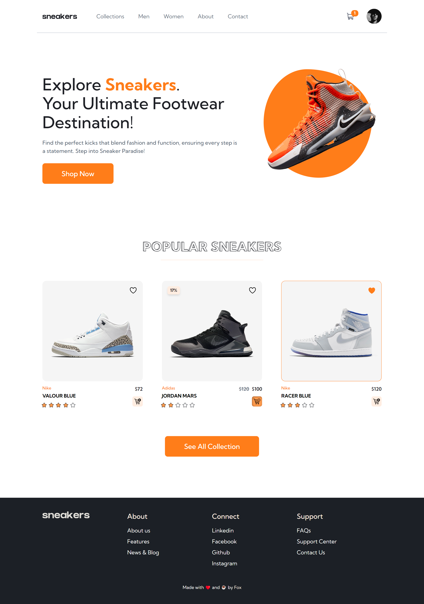

# E-commerce App

## Table of contents

- [Overview](#overview)
  - [Screenshot](#screenshot)
  - [Links](#links)
- [My process](#my-process)
  - [Built with](#built-with)
  - [What I learned](#what-i-learned)
  - [Continued development](#continued-development)
- [Author](#author)

## Overview

### Screenshot

### Links

- Live Site URL: [Sneakers](http://foxsneakers.netlify.app/)

## My process

### Built with

- Semantic HTML5 markup
- [Tailwind](https://tailwindcss.com/) CSS
- Flexbox
- CSS Grid
- Mobile-first workflow
- [React](https://reactjs.org/) - JS library
- [Framer Motion](https://www.framer.com/)
- [Redux](https://redux-toolkit.js.org/) Toolkit
- [Vite](https://vitejs.dev/)

### What I learned

- Redux toolkit and in state management in depth
- React Router v6.0
- Framer Motion animations, and routing animations
- Fetching and dealing with rest api data
- Turning SVG images into components and using them

### Continued development

My next step is to focus on Authorization and Authintication, dealing more with backend and data bases, instead of keeping it minimal.

## Author

- [Website](https://mohamed-dev.netlify.app/)
- [Linkedin](https://www.linkedin.com/in/mohamed-ashraf-142659246/)
